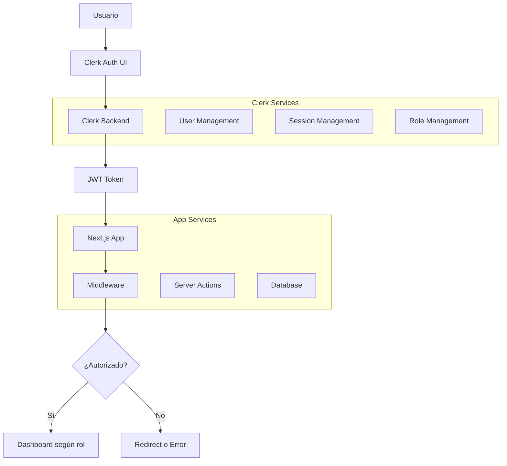

# 🔐 Documentación de Clerk - Autenticación y Gestión de Usuarios

## Introducción

Clerk es el servicio de autenticación y gestión de usuarios utilizado en CoreAppEduTech. Proporciona una solución completa y segura para el manejo de identidades, roles y permisos dentro del sistema educativo.

## 🎯 ¿Por qué Clerk?

### Ventajas Principales
- **Seguridad Robusta**: Autenticación moderna con MFA, SSO y OAuth
- **Fácil Integración**: SDK nativo para Next.js y React
- **Gestión de Roles**: Sistema flexible de roles y metadatos
- **Experiencia de Usuario**: UI/UX optimizada y personalizable
- **Escalabilidad**: Maneja desde pequeñas escuelas hasta grandes instituciones
- **Compliance**: Cumple con GDPR, CCPA y otros estándares

### Características Implementadas
- ✅ Autenticación con email/contraseña
- ✅ Gestión de sesiones seguras
- ✅ Sistema de roles multinivel
- ✅ Metadatos personalizados de usuario
- ✅ Protección de rutas por rol
- ✅ Middleware de autorización
- ✅ UI personalizada en español

## 🏗️ Arquitectura de Autenticación



## 🔧 Configuración de Clerk

### 1. Variables de Entorno
```env
# Clerk Configuration
NEXT_PUBLIC_CLERK_PUBLISHABLE_KEY=pk_test_your_publishable_key
CLERK_SECRET_KEY=sk_test_your_secret_key

# URLs de Redirección
NEXT_PUBLIC_CLERK_SIGN_IN_URL=/sign-in
NEXT_PUBLIC_CLERK_SIGN_UP_URL=/sign-up
NEXT_PUBLIC_CLERK_AFTER_SIGN_IN_URL=/dashboard
NEXT_PUBLIC_CLERK_AFTER_SIGN_UP_URL=/dashboard
```

### 2. Configuración en layout.tsx
```typescript
import { ClerkProvider } from '@clerk/nextjs'
import { esES } from '@clerk/localizations'

export default function RootLayout({
  children,
}: {
  children: React.ReactNode
}) {
  return (
    <ClerkProvider
      localization={esES}
      appearance={{
        baseTheme: undefined,
        variables: {
          colorPrimary: '#3B82F6',
          colorText: '#1F2937',
          colorBackground: '#FFFFFF',
          colorInputBackground: '#F9FAFB',
          colorInputText: '#111827',
        },
        elements: {
          formButtonPrimary: 'bg-blue-600 hover:bg-blue-700',
          card: 'shadow-lg border border-gray-200',
          headerTitle: 'text-2xl font-bold text-gray-900',
          headerSubtitle: 'text-gray-600',
        }
      }}
    >
      <html lang="es">
        <body>
          {children}
        </body>
      </html>
    </ClerkProvider>
  )
}
```

## 👥 Sistema de Roles

### Estructura de Roles
El sistema maneja cuatro roles principales con diferentes niveles de acceso:

```typescript
interface UserRole {
  role: 'admin' | 'teacher' | 'student' | 'parent'
  permissions: string[]
  restrictions: string[]
}
```

### 1. Administrador (admin)
**Permisos:**
- ✅ Acceso completo al sistema
- ✅ Gestión de usuarios (crear, editar, eliminar)
- ✅ Configuración del sistema
- ✅ Gestión de clases y materias
- ✅ Visualización de todos los reportes
- ✅ Gestión de eventos y anuncios

**Rutas Accesibles:**
- `/admin` - Dashboard principal
- `/list/*` - Todas las listas
- Todas las funciones CRUD

### 2. Profesor (teacher)
**Permisos:**
- ✅ Gestión de sus clases asignadas
- ✅ Registro de asistencias
- ✅ Creación y gestión de exámenes
- ✅ Creación y gestión de tareas
- ✅ Ingreso de calificaciones
- ✅ Visualización de estudiantes asignados
- ✅ Creación de anuncios para sus clases

**Restricciones:**
- ❌ No puede ver datos de otras clases
- ❌ No puede gestionar usuarios
- ❌ No puede modificar configuraciones del sistema

**Rutas Accesibles:**
- `/teacher` - Dashboard del profesor
- `/list/students` - Solo estudiantes de sus clases
- `/list/lessons` - Solo sus lecciones
- `/list/exams` - Solo sus exámenes
- `/list/assignments` - Solo sus tareas

### 3. Estudiante (student)
**Permisos:**
- ✅ Visualización de su información personal
- ✅ Consulta de horarios y clases
- ✅ Visualización de calificaciones
- ✅ Visualización de tareas y exámenes
- ✅ Consulta de asistencias
- ✅ Visualización de anuncios de sus clases

**Restricciones:**
- ❌ No puede ver información de otros estudiantes
- ❌ No puede modificar datos
- ❌ Solo visualización de su información

**Rutas Accesibles:**
- `/student` - Dashboard del estudiante
- Solo visualización de datos propios

### 4. Padre (parent)
**Permisos:**
- ✅ Visualización de información de sus hijos
- ✅ Consulta de calificaciones de sus hijos
- ✅ Visualización de asistencias de sus hijos
- ✅ Consulta de tareas y exámenes
- ✅ Comunicación con profesores
- ✅ Visualización de anuncios relevantes

**Restricciones:**
- ❌ Solo información de sus hijos registrados
- ❌ No puede modificar datos académicos
- ❌ Solo visualización

**Rutas Accesibles:**
- `/parent` - Dashboard del padre
- Información filtrada por hijos

## 🛡️ Middleware de Autorización

### Configuración del Middleware
```typescript
// src/middleware.ts
import { clerkMiddleware, createRouteMatcher } from "@clerk/nextjs/server";
import { NextResponse } from "next/server";

const isPublicRoute = createRouteMatcher([
  "/sign-in(.*)",
  "/sign-up(.*)",
  "/",
  "/api/webhooks(.*)"
]);

const roleBasedRoutes = [
  {
    matcher: createRouteMatcher(["/admin(.*)"]),
    allowedRoles: ["admin"]
  },
  {
    matcher: createRouteMatcher(["/teacher(.*)"]),
    allowedRoles: ["admin", "teacher"]
  },
  {
    matcher: createRouteMatcher(["/student(.*)"]),
    allowedRoles: ["admin", "student"]
  },
  {
    matcher: createRouteMatcher(["/parent(.*)"]),
    allowedRoles: ["admin", "parent"]
  },
  {
    matcher: createRouteMatcher(["/list(.*)"]),
    allowedRoles: ["admin", "teacher"]
  }
];

export default clerkMiddleware((auth, req) => {
  if (isPublicRoute(req)) return NextResponse.next();

  const { sessionClaims } = auth();
  const role = sessionClaims?.metadata?.role;

  if (!role) {
    return NextResponse.redirect(new URL("/sign-in", req.url));
  }

  // Verificar permisos por ruta
  for (const { matcher, allowedRoles } of roleBasedRoutes) {
    if (matcher(req)) {
      if (!allowedRoles.includes(role)) {
        return NextResponse.redirect(new URL(`/${role}`, req.url));
      }
    }
  }

  return NextResponse.next();
});

export const config = {
  matcher: ["/((?!.*\\..*|_next).*)", "/", "/(api|trpc)(.*)"],
};
```

## 🔄 Gestión de Metadatos de Usuario

### Estructura de Metadatos
```typescript
interface UserMetadata {
  role: 'admin' | 'teacher' | 'student' | 'parent';
  schoolId?: string;
  classIds?: string[];
  subjectIds?: string[];
  studentIds?: string[]; // Para padres
  permissions?: string[];
  preferences?: {
    language: string;
    theme: string;
    notifications: boolean;
  };
}
```

### Configuración de Metadatos
```typescript
// Ejemplo de configuración de metadatos para un profesor
const teacherMetadata = {
  role: 'teacher',
  schoolId: 'school-123',
  classIds: ['class-1a', 'class-2b'],
  subjectIds: ['math', 'physics'],
  permissions: [
    'read:students',
    'write:grades',
    'write:attendance',
    'write:exams',
    'write:assignments'
  ],
  preferences: {
    language: 'es',
    theme: 'light',
    notifications: true
  }
};
```

## 🎨 Personalización de UI

### Componentes Personalizados
```typescript
// Botón de usuario personalizado
import { UserButton } from "@clerk/nextjs";

export const CustomUserButton = () => {
  return (
    <UserButton 
      appearance={{
        elements: {
          avatarBox: "w-10 h-10",
          userButtonPopoverCard: "shadow-xl border border-gray-200",
          userButtonPopoverActionButton: "text-gray-700 hover:bg-gray-100"
        }
      }}
      userProfileMode="navigation"
      userProfileUrl="/user-profile"
      afterSignOutUrl="/sign-in"
    />
  );
};
```

### Páginas de Autenticación
```typescript
// Página de sign-in personalizada
import { SignIn } from "@clerk/nextjs";

export default function SignInPage() {
  return (
    <div className="min-h-screen flex items-center justify-center bg-gradient-to-br from-blue-50 to-indigo-100">
      <div className="max-w-md w-full space-y-8">
        <div className="text-center">
          <h2 className="text-3xl font-bold text-gray-900">
            Bienvenido a CoreAppEduTech
          </h2>
          <p className="mt-2 text-gray-600">
            Inicia sesión para acceder al sistema
          </p>
        </div>
        <SignIn 
          appearance={{
            elements: {
              card: "shadow-xl border-0",
              headerTitle: "text-2xl font-bold text-gray-900",
              headerSubtitle: "text-gray-600",
              formButtonPrimary: "bg-blue-600 hover:bg-blue-700 text-white font-semibold py-2 px-4 rounded-lg transition duration-200",
              formFieldInput: "border-gray-300 focus:border-blue-500 focus:ring-blue-500",
              footerActionText: "text-gray-600",
              footerActionLink: "text-blue-600 hover:text-blue-800 font-semibold"
            }
          }}
        />
      </div>
    </div>
  );
}
```

## 🔒 Funciones de Seguridad

### Verificación de Roles en Server Actions
```typescript
// lib/auth-utils.ts
import { auth } from "@clerk/nextjs/server";

export async function requireRole(allowedRoles: string[]) {
  const { sessionClaims } = auth();
  const userRole = sessionClaims?.metadata?.role;
  
  if (!userRole || !allowedRoles.includes(userRole)) {
    throw new Error("Acceso no autorizado");
  }
  
  return userRole;
}

// Ejemplo de uso en Server Action
export async function createStudent(data: StudentData) {
  await requireRole(['admin', 'teacher']);
  
  // Lógica para crear estudiante
}
```

### Protección de Componentes
```typescript
// components/ProtectedComponent.tsx
import { useUser } from "@clerk/nextjs";

interface ProtectedComponentProps {
  allowedRoles: string[];
  children: React.ReactNode;
  fallback?: React.ReactNode;
}

export const ProtectedComponent = ({ 
  allowedRoles, 
  children, 
  fallback 
}: ProtectedComponentProps) => {
  const { user } = useUser();
  const userRole = user?.publicMetadata?.role as string;
  
  if (!userRole || !allowedRoles.includes(userRole)) {
    return fallback || <div>No tienes permisos para ver este contenido</div>;
  }
  
  return <>{children}</>;
};
```

## 📊 Hooks Personalizados

### useUserRole Hook
```typescript
// hooks/useUserRole.ts
import { useUser } from "@clerk/nextjs";

export const useUserRole = () => {
  const { user, isLoaded } = useUser();
  
  const role = user?.publicMetadata?.role as string;
  const permissions = user?.publicMetadata?.permissions as string[] || [];
  
  const hasPermission = (permission: string) => {
    return permissions.includes(permission) || role === 'admin';
  };
  
  const canAccess = (requiredRoles: string[]) => {
    return requiredRoles.includes(role) || role === 'admin';
  };
  
  return {
    role,
    permissions,
    hasPermission,
    canAccess,
    isLoaded,
    user
  };
};
```

### useStudentData Hook (para padres)
```typescript
// hooks/useStudentData.ts
import { useUser } from "@clerk/nextjs";

export const useStudentData = () => {
  const { user } = useUser();
  const studentIds = user?.publicMetadata?.studentIds as string[] || [];
  
  // Lógica para obtener datos de estudiantes
  const fetchStudentData = async () => {
    // Implementación
  };
  
  return {
    studentIds,
    fetchStudentData
  };
};
```

## 🚀 Mejores Prácticas

### 1. Seguridad
- **Nunca almacenar información sensible** en metadatos públicos
- **Validar permisos** tanto en cliente como en servidor
- **Usar HTTPS** siempre en producción
- **Implementar rate limiting** para APIs sensibles

### 2. Rendimiento
- **Cachear datos de usuario** cuando sea posible
- **Lazy load** componentes protegidos
- **Optimizar queries** basadas en rol
- **Usar Server Components** para datos estáticos

### 3. Experiencia de Usuario
- **Feedback claro** sobre permisos
- **Navegación intuitiva** basada en rol
- **Carga progressive** de información
- **Manejo graceful** de errores

### 4. Mantenimiento
- **Documentar permisos** claramente
- **Testing de roles** automatizado
- **Auditoría de accesos** regular
- **Actualizaciones de seguridad** frecuentes

## 🐛 Solución de Problemas Comunes

### Error: "User not found"
```typescript
// Verificar que el usuario esté autenticado
const { user } = useUser();

if (!user) {
  return <div>Cargando...</div>;
}
```

### Error: "Role not defined"
```typescript
// Asegurar que los metadatos estén configurados
useEffect(() => {
  if (user && !user.publicMetadata?.role) {
    // Redirigir a configuración de perfil
    router.push('/setup-profile');
  }
}, [user]);
```

### Problemas de Redirección
```typescript
// Configurar URLs correctamente en Clerk Dashboard
const clerkConfig = {
  signInUrl: '/sign-in',
  signUpUrl: '/sign-up',
  afterSignInUrl: '/dashboard',
  afterSignUpUrl: '/setup-profile'
};
```

Esta implementación de Clerk proporciona una base sólida y segura para la autenticación y autorización en CoreAppEduTech, asegurando que cada usuario tenga acceso únicamente a la información y funcionalidades apropiadas para su rol en el sistema educativo.