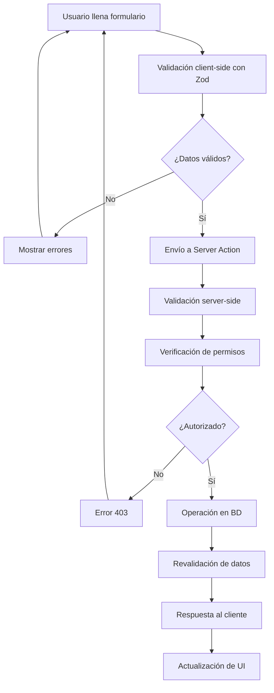

# 📝 Documentación de Formularios - CoreAppEduTech

## Introducción

Los formularios en CoreAppEduTech constituyen la interfaz principal para la entrada y edición de datos. Implementan un sistema robusto de validación con React Hook Form y Zod, proporcionando una experiencia de usuario fluida y segura.

## 🏗️ Arquitectura de Formularios

### Stack Tecnológico
```typescript
interface FormStack {
  validation: "Zod";           // Validación de esquemas
  formManagement: "React Hook Form"; // Gestión de estado de formularios
  ui: "Tailwind CSS";          // Estilos y diseño
  serverActions: "Next.js";    // Acciones del servidor
  imageUpload: "Cloudinary";   // Gestión de imágenes
  localization: "Spanish";     // Idioma español
}
```

### Flujo de Datos


### Estructura Base de Formulario
```typescript
interface FormComponent<T> {
  type: "create" | "update" | "delete";
  data?: T;
  schema: ZodSchema<T>;
  onSubmit: (data: T) => Promise<void>;
  fields: FormField[];
  validation: ValidationRules;
  localization: SpanishLabels;
}
```

## 👨‍🏫 Formulario de Profesor

### `TeacherForm.tsx` - Gestión de Profesores

**Propósito**: Crear y editar información de profesores del sistema.

**Esquema de Validación:**
```typescript
// lib/formValidationSchemas.ts
export const teacherSchema = z.object({
  username: z
    .string()
    .min(3, { message: "El nombre de usuario debe tener al menos 3 caracteres!" })
    .max(20, { message: "El nombre de usuario debe tener máximo 20 caracteres!" }),
  name: z
    .string()
    .min(1, { message: "El nombre es obligatorio!" })
    .max(50, { message: "El nombre debe tener máximo 50 caracteres!" }),
  surname: z
    .string()
    .min(1, { message: "El apellido es obligatorio!" })
    .max(50, { message: "El apellido debe tener máximo 50 caracteres!" }),
  email: z
    .string()
    .email({ message: "Dirección de email inválida!" })
    .optional()
    .or(z.literal("")),
  phone: z
    .string()
    .min(10, { message: "El teléfono debe tener al menos 10 dígitos!" })
    .optional()
    .or(z.literal("")),
  address: z
    .string()
    .min(5, { message: "La dirección debe tener al menos 5 caracteres!" }),
  bloodType: z
    .string()
    .min(1, { message: "El tipo de sangre es obligatorio!" }),
  sex: z.enum(["MALE", "FEMALE"], { 
    message: "El sexo es obligatorio!" 
  }),
  birthday: z.coerce.date({ 
    message: "La fecha de nacimiento es obligatoria!" 
  }),
  img: z.string().optional(),
  subjects: z
    .array(z.string())
    .min(1, { message: "Al menos una materia debe ser seleccionada!" }),
});

export type TeacherSchema = z.infer<typeof teacherSchema>;
```

**Implementación del Componente:**
```typescript
// components/forms/TeacherForm.tsx
"use client";

import { zodResolver } from "@hookform/resolvers/zod";
import { useForm } from "react-hook-form";
import { teacherSchema, TeacherSchema } from "@/lib/formValidationSchemas";
import { createTeacher, updateTeacher } from "@/lib/actions";
import InputField from "../InputField";
import Image from "next/image";
import { CldUploadWidget } from "next-cloudinary";
import { useRouter } from "next/navigation";
import { toast } from "react-toastify";

const TeacherForm = ({
  type,
  data,
  relatedData,
}: {
  type: "create" | "update";
  data?: any;
  relatedData?: any;
}) => {
  const {
    register,
    handleSubmit,
    formState: { errors },
    setValue,
    watch,
  } = useForm<TeacherSchema>({
    resolver: zodResolver(teacherSchema),
    defaultValues: data && {
      username: data.username,
      name: data.name,
      surname: data.surname,
      email: data.email || "",
      phone: data.phone || "",
      address: data.address,
      bloodType: data.bloodType,
      sex: data.sex,
      birthday: new Date(data.birthday),
      img: data.img || "",
      subjects: data.subjects?.map((subject: any) => subject.id) || [],
    },
  });

  const router = useRouter();
  const img = watch("img");

  const onSubmit = handleSubmit(async (formData) => {
    try {
      if (type === "create") {
        await createTeacher(formData);
        toast.success("Profesor creado exitosamente");
      } else {
        await updateTeacher(formData, data.id);
        toast.success("Profesor actualizado exitosamente");
      }
      router.refresh();
    } catch (error) {
      console.error(error);
      toast.error("¡Algo salió mal!");
    }
  });

  return (
    <form className="flex flex-col gap-8" onSubmit={onSubmit}>
      <h1 className="text-xl font-semibold">
        {type === "create" ? "Crear un nuevo profesor" : "Actualizar el profesor"}
      </h1>
      
      <span className="text-xs text-gray-400 font-medium">
        Información de Autenticación
      </span>
      
      <div className="flex justify-between flex-wrap gap-4">
        <InputField
          label="Nombre de Usuario"
          name="username"
          defaultValue={data?.username}
          register={register}
          error={errors?.username}
        />
        <InputField
          label="Email"
          name="email"
          type="email"
          defaultValue={data?.email}
          register={register}
          error={errors?.email}
        />
      </div>
      
      <span className="text-xs text-gray-400 font-medium">
        Información Personal
      </span>
      
      <div className="flex justify-between flex-wrap gap-4">
        <InputField
          label="Nombre"
          name="name"
          defaultValue={data?.name}
          register={register}
          error={errors?.name}
        />
        <InputField
          label="Apellido"
          name="surname"
          defaultValue={data?.surname}
          register={register}
          error={errors?.surname}
        />
        <InputField
          label="Teléfono"
          name="phone"
          defaultValue={data?.phone}
          register={register}
          error={errors?.phone}
        />
        <InputField
          label="Dirección"
          name="address"
          defaultValue={data?.address}
          register={register}
          error={errors?.address}
        />
        <InputField
          label="Tipo de Sangre"
          name="bloodType"
          defaultValue={data?.bloodType}
          register={register}
          error={errors?.bloodType}
        />
        <InputField
          label="Fecha de Nacimiento"
          name="birthday"
          type="date"
          defaultValue={data?.birthday?.toISOString().split("T")[0]}
          register={register}
          error={errors?.birthday}
        />
        
        <div className="flex flex-col gap-2 w-full md:w-1/4">
          <label className="text-xs text-gray-500">Sexo</label>
          <select
            className="ring-[1.5px] ring-gray-300 p-2 rounded-md text-sm w-full"
            {...register("sex")}
            defaultValue={data?.sex}
          >
            <option value="">Seleccionar</option>
            <option value="MALE">Masculino</option>
            <option value="FEMALE">Femenino</option>
          </select>
          {errors.sex?.message && (
            <p className="text-xs text-red-400">
              {errors.sex.message.toString()}
            </p>
          )}
        </div>
        
        {/* Selector de Materias */}
        <div className="flex flex-col gap-2 w-full md:w-1/4">
          <label className="text-xs text-gray-500">Materias</label>
          <select
            multiple
            className="ring-[1.5px] ring-gray-300 p-2 rounded-md text-sm w-full"
            {...register("subjects")}
            defaultValue={data?.subjects?.map((subject: any) => subject.id)}
          >
            {relatedData?.subjects?.map((subject: any) => (
              <option value={subject.id} key={subject.id}>
                {subject.name}
              </option>
            ))}
          </select>
          {errors.subjects?.message && (
            <p className="text-xs text-red-400">
              {errors.subjects.message.toString()}
            </p>
          )}
        </div>
        
        {/* Upload de Imagen */}
        <div className="flex flex-col gap-2 w-full md:w-1/4 justify-center">
          <label className="text-xs text-gray-500 flex items-center gap-2 cursor-pointer">
            <Image src="/upload.png" alt="" width={28} height={28} />
            <span>Subir una foto</span>
          </label>
          <CldUploadWidget
            uploadPreset="edutech"
            onSuccess={(result, { widget }) => {
              setValue("img", result.info?.secure_url);
              widget.close();
            }}
          >
            {({ open }) => {
              return (
                <div
                  className="text-xs text-gray-500 flex items-center gap-2 cursor-pointer"
                  onClick={() => open()}
                >
                  <Image src="/upload.png" alt="" width={28} height={28} />
                  <span>Subir una foto</span>
                </div>
              );
            }}
          </CldUploadWidget>
          {img && (
            <Image
              src={img}
              alt=""
              width={72}
              height={72}
              className="w-18 h-18 rounded-full object-cover"
            />
          )}
          {errors.img?.message && (
            <p className="text-xs text-red-400">
              {errors.img.message.toString()}
            </p>
          )}
        </div>
      </div>
      
      <button
        type="submit"
        className="bg-blue-400 text-white p-2 rounded-md"
      >
        {type === "create" ? "Crear" : "Actualizar"}
      </button>
    </form>
  );
};

export default TeacherForm;
```

**Características Específicas:**
- ✅ Validación completa de datos personales
- ✅ Selección múltiple de materias
- ✅ Upload de imagen con Cloudinary
- ✅ Validación de email y teléfono
- ✅ Selección de tipo de sangre y sexo
- ✅ Fechas con validación

## 🎓 Formulario de Estudiante

### `StudentForm.tsx` - Gestión de Estudiantes

**Esquema de Validación:**
```typescript
export const studentSchema = z.object({
  username: z
    .string()
    .min(3, { message: "El nombre de usuario debe tener al menos 3 caracteres!" })
    .max(20, { message: "El nombre de usuario debe tener máximo 20 caracteres!" }),
  name: z.string().min(1, { message: "El nombre es obligatorio!" }),
  surname: z.string().min(1, { message: "El apellido es obligatorio!" }),
  email: z
    .string()
    .email({ message: "Dirección de email inválida!" })
    .optional()
    .or(z.literal("")),
  phone: z.string().optional().or(z.literal("")),
  address: z.string().min(1, { message: "La dirección es obligatoria!" }),
  img: z.string().optional(),
  bloodType: z.string().min(1, { message: "El tipo de sangre es obligatorio!" }),
  sex: z.enum(["MALE", "FEMALE"], { message: "El sexo es obligatorio!" }),
  birthday: z.coerce.date({ message: "La fecha de nacimiento es obligatoria!" }),
  gradeId: z.coerce.number().min(1, { message: "El grado es obligatorio!" }),
  classId: z.coerce.number().min(1, { message: "La clase es obligatoria!" }),
  parentId: z.string().min(1, { message: "El padre/madre es obligatorio!" }),
});

export type StudentSchema = z.infer<typeof studentSchema>;
```

**Funcionalidades Específicas:**
- ✅ Asignación de grado y clase
- ✅ Vinculación con padre/madre
- ✅ Información médica básica
- ✅ Datos de contacto de emergencia
- ✅ Historial académico

## 👨‍👩‍👧‍👦 Formulario de Padre

### `ParentForm.tsx` - Gestión de Padres

**Esquema de Validación:**
```typescript
export const parentSchema = z.object({
  username: z
    .string()
    .min(3, { message: "El nombre de usuario debe tener al menos 3 caracteres!" })
    .max(20, { message: "El nombre de usuario debe tener máximo 20 caracteres!" }),
  name: z.string().min(1, { message: "El nombre es obligatorio!" }),
  surname: z.string().min(1, { message: "El apellido es obligatorio!" }),
  email: z
    .string()
    .email({ message: "Dirección de email inválida!" })
    .optional()
    .or(z.literal("")),
  phone: z.string().min(1, { message: "El teléfono es obligatorio!" }),
  address: z.string().min(1, { message: "La dirección es obligatoria!" }),
});

export type ParentSchema = z.infer<typeof parentSchema>;
```

**Características Específicas:**
- ✅ Información de contacto principal
- ✅ Relación con estudiantes
- ✅ Preferencias de comunicación
- ✅ Datos de emergencia
- ✅ Autorización de recogida

## 🏫 Formulario de Clase

### `ClassForm.tsx` - Gestión de Clases

**Esquema de Validación:**
```typescript
export const classSchema = z.object({
  name: z
    .string()
    .min(1, { message: "El nombre de la clase es obligatorio!" })
    .max(50, { message: "El nombre debe tener máximo 50 caracteres!" }),
  capacity: z.coerce
    .number()
    .min(1, { message: "La capacidad debe ser al menos 1!" })
    .max(50, { message: "La capacidad no puede exceder 50 estudiantes!" }),
  gradeId: z.coerce
    .number()
    .min(1, { message: "El grado es obligatorio!" }),
  supervisorId: z
    .string()
    .min(1, { message: "El profesor supervisor es obligatorio!" }),
});

export type ClassSchema = z.infer<typeof classSchema>;
```

**Funcionalidades Específicas:**
- ✅ Asignación de profesor supervisor
- ✅ Control de capacidad
- ✅ Vinculación con grado académico
- ✅ Gestión de recursos del aula
- ✅ Configuración de horarios

## 📚 Formulario de Materia

### `SubjectForm.tsx` - Gestión de Materias

**Esquema de Validación:**
```typescript
export const subjectSchema = z.object({
  name: z
    .string()
    .min(1, { message: "El nombre de la materia es obligatorio!" })
    .max(100, { message: "El nombre debe tener máximo 100 caracteres!" }),
  teacherIds: z
    .array(z.string())
    .min(1, { message: "Al menos un profesor debe ser asignado!" }),
});

export type SubjectSchema = z.infer<typeof subjectSchema>;
```

**Características Específicas:**
- ✅ Asignación múltiple de profesores
- ✅ Configuración curricular
- ✅ Recursos didácticos
- ✅ Evaluación y criterios
- ✅ Planificación académica

## 📖 Formulario de Lección

### `LessonForm.tsx` - Gestión de Lecciones

**Esquema de Validación:**
```typescript
export const lessonSchema = z.object({
  name: z.string().min(1, { message: "El nombre de la lección es obligatorio!" }),
  day: z.enum(["MONDAY", "TUESDAY", "WEDNESDAY", "THURSDAY", "FRIDAY"], {
    message: "El día es obligatorio!",
  }),
  startTime: z.coerce.date({ message: "La hora de inicio es obligatoria!" }),
  endTime: z.coerce.date({ message: "La hora de fin es obligatoria!" }),
  subjectId: z.coerce.number().min(1, { message: "La materia es obligatoria!" }),
  classId: z.coerce.number().min(1, { message: "La clase es obligatoria!" }),
  teacherId: z.string().min(1, { message: "El profesor es obligatorio!" }),
});

export type LessonSchema = z.infer<typeof lessonSchema>;
```

**Funcionalidades Específicas:**
- ✅ Programación de horarios
- ✅ Asignación de recursos
- ✅ Planificación de contenido
- ✅ Gestión de materiales
- ✅ Control de asistencias

## 📝 Formulario de Examen

### `ExamForm.tsx` - Gestión de Exámenes

**Esquema de Validación:**
```typescript
export const examSchema = z.object({
  title: z.string().min(1, { message: "El título del examen es obligatorio!" }),
  startTime: z.coerce.date({ message: "La fecha de inicio es obligatoria!" }),
  endTime: z.coerce.date({ message: "La fecha de fin es obligatoria!" }),
  lessonId: z.coerce.number().min(1, { message: "La lección es obligatoria!" }),
});

export type ExamSchema = z.infer<typeof examSchema>;
```

**Características Específicas:**
- ✅ Programación de evaluaciones
- ✅ Configuración de duración
- ✅ Asignación a lecciones
- ✅ Criterios de evaluación
- ✅ Gestión de resultados

## 📋 Formulario de Tarea

### `AssignmentForm.tsx` - Gestión de Tareas

**Esquema de Validación:**
```typescript
export const assignmentSchema = z.object({
  title: z.string().min(1, { message: "El título de la tarea es obligatorio!" }),
  startDate: z.coerce.date({ message: "La fecha de inicio es obligatoria!" }),
  dueDate: z.coerce.date({ message: "La fecha de entrega es obligatoria!" }),
  lessonId: z.coerce.number().min(1, { message: "La lección es obligatoria!" }),
});

export type AssignmentSchema = z.infer<typeof assignmentSchema>;
```

**Funcionalidades Específicas:**
- ✅ Gestión de fechas de entrega
- ✅ Asignación a lecciones
- ✅ Criterios de evaluación
- ✅ Seguimiento de progreso
- ✅ Retroalimentación detallada

## 📢 Formulario de Anuncio

### `AnnouncementForm.tsx` - Gestión de Anuncios

**Esquema de Validación:**
```typescript
export const announcementSchema = z.object({
  title: z.string().min(1, { message: "El título es obligatorio!" }),
  description: z.string().min(1, { message: "La descripción es obligatoria!" }),
  date: z.coerce.date({ message: "La fecha es obligatoria!" }),
  classId: z.coerce.number().optional(),
});

export type AnnouncementSchema = z.infer<typeof announcementSchema>;
```

**Características Específicas:**
- ✅ Segmentación por clase
- ✅ Programación de publicación
- ✅ Priorización de mensajes
- ✅ Seguimiento de visualizaciones
- ✅ Notificaciones automáticas

## 📅 Formulario de Evento

### `EventForm.tsx` - Gestión de Eventos

**Esquema de Validación:**
```typescript
export const eventSchema = z.object({
  title: z.string().min(1, { message: "El título es obligatorio!" }),
  description: z.string().min(1, { message: "La descripción es obligatoria!" }),
  startTime: z.coerce.date({ message: "La fecha de inicio es obligatoria!" }),
  endTime: z.coerce.date({ message: "La fecha de fin es obligatoria!" }),
  classId: z.coerce.number().optional(),
});

export type EventSchema = z.infer<typeof eventSchema>;
```

**Funcionalidades Específicas:**
- ✅ Programación de actividades
- ✅ Gestión de participantes
- ✅ Recursos y logística
- ✅ Comunicación y notificaciones
- ✅ Seguimiento post-evento

## 🧩 Componentes Reutilizables

### InputField Component
```typescript
// components/InputField.tsx
import { FieldError } from "react-hook-form";

const InputField = ({
  label,
  type = "text",
  register,
  name,
  defaultValue,
  error,
  inputProps,
}: {
  label: string;
  type?: string;
  register: any;
  name: string;
  defaultValue?: string;
  error?: FieldError;
  inputProps?: React.InputHTMLAttributes<HTMLInputElement>;
}) => {
  return (
    <div className="flex flex-col gap-2 w-full md:w-1/4">
      <label className="text-xs text-gray-500">{label}</label>
      <input
        type={type}
        {...register(name)}
        className={`ring-[1.5px] ring-gray-300 p-2 rounded-md text-sm w-full ${
          error ? "ring-red-400" : ""
        }`}
        defaultValue={defaultValue}
        {...inputProps}
      />
      {error?.message && (
        <p className="text-xs text-red-400">{error.message.toString()}</p>
      )}
    </div>
  );
};

export default InputField;
```

### FormModal Component
```typescript
// components/FormModal.tsx
"use client";

import dynamic from "next/dynamic";
import Image from "next/image";
import { useState } from "react";

// Lazy loading de formularios
const TeacherForm = dynamic(() => import("./forms/TeacherForm"), {
  loading: () => <h1>Cargando...</h1>,
});

const StudentForm = dynamic(() => import("./forms/StudentForm"), {
  loading: () => <h1>Cargando...</h1>,
});

// ... otros formularios

const forms: {
  [key: string]: (type: "create" | "update", data?: any, relatedData?: any) => JSX.Element;
} = {
  teacher: (type, data, relatedData) => (
    <TeacherForm type={type} data={data} relatedData={relatedData} />
  ),
  student: (type, data, relatedData) => (
    <StudentForm type={type} data={data} relatedData={relatedData} />
  ),
  // ... otros formularios
};

const FormModal = ({
  table,
  type,
  data,
  id,
  relatedData,
}: {
  table:
    | "teacher"
    | "student"
    | "parent"
    | "subject"
    | "class"
    | "lesson"
    | "exam"
    | "assignment"
    | "result"
    | "attendance"
    | "event"
    | "announcement";
  type: "create" | "update" | "delete";
  data?: any;
  id?: number | string;
  relatedData?: any;
}) => {
  const [open, setOpen] = useState(false);

  const Form = () => {
    if (type === "delete" && id) {
      return (
        <form className="p-4 flex flex-col gap-4">
          <span className="text-center font-medium">
            ¿Estás seguro de que quieres eliminar este {table}?
          </span>
          <button className="bg-red-700 text-white py-2 px-4 rounded-md border-none w-max self-center">
            Eliminar
          </button>
        </form>
      );
    }

    if (type === "create" || type === "update") {
      return forms[table](type, data, relatedData);
    }

    return <div>Formulario no encontrado</div>;
  };

  return (
    <>
      <button
        className={`${
          type === "create"
            ? "w-8 h-8 flex items-center justify-center rounded-full bg-lamaYellow"
            : type === "update"
            ? "w-7 h-7 flex items-center justify-center rounded-full bg-lamaSky"
            : "w-7 h-7 flex items-center justify-center rounded-full bg-lamaPurple"
        }`}
        onClick={() => setOpen(true)}
      >
        <Image src={`/${type}.png`} alt="" width={16} height={16} />
      </button>
      
      {open && (
        <div className="w-screen h-screen absolute left-0 top-0 bg-black bg-opacity-60 z-50 flex items-center justify-center">
          <div className="bg-white p-4 rounded-md relative w-[90%] md:w-[70%] lg:w-[60%] xl:w-[50%] 2xl:w-[40%]">
            <Form />
            <div
              className="absolute top-4 right-4 cursor-pointer"
              onClick={() => setOpen(false)}
            >
              <Image src="/close.png" alt="" width={14} height={14} />
            </div>
          </div>
        </div>
      )}
    </>
  );
};

export default FormModal;
```

## 🔧 Server Actions

### Estructura de Acciones del Servidor
```typescript
// lib/actions.ts
import { auth, clerkClient } from "@clerk/nextjs/server";
import prisma from "./prisma";
import { revalidatePath } from "next/cache";

export const createTeacher = async (data: TeacherSchema) => {
  const { sessionClaims } = auth();
  const role = (sessionClaims?.metadata as { role?: string })?.role;
  
  if (role !== "admin") {
    throw new Error("No autorizado");
  }

  try {
    // Crear usuario en Clerk
    const user = await clerkClient.users.createUser({
      username: data.username,
      password: "defaultPassword123!", // Temporal
      publicMetadata: {
        role: "teacher",
      },
    });

    // Crear profesor en base de datos
    await prisma.teacher.create({
      data: {
        id: user.id,
        username: data.username,
        name: data.name,
        surname: data.surname,
        email: data.email || null,
        phone: data.phone || null,
        address: data.address,
        img: data.img || null,
        bloodType: data.bloodType,
        sex: data.sex,
        birthday: data.birthday,
        subjects: {
          connect: data.subjects?.map((subjectId: string) => ({
            id: parseInt(subjectId),
          })),
        },
      },
    });

    revalidatePath("/list/teachers");
    return { success: true };
  } catch (err) {
    console.error(err);
    throw new Error("Error al crear el profesor");
  }
};

export const updateTeacher = async (data: TeacherSchema, id: string) => {
  const { sessionClaims } = auth();
  const role = (sessionClaims?.metadata as { role?: string })?.role;
  
  if (role !== "admin") {
    throw new Error("No autorizado");
  }

  try {
    // Actualizar información en Clerk
    await clerkClient.users.updateUser(id, {
      username: data.username,
    });

    // Actualizar en base de datos
    await prisma.teacher.update({
      where: { id },
      data: {
        username: data.username,
        name: data.name,
        surname: data.surname,
        email: data.email || null,
        phone: data.phone || null,
        address: data.address,
        img: data.img || null,
        bloodType: data.bloodType,
        sex: data.sex,
        birthday: data.birthday,
        subjects: {
          set: data.subjects?.map((subjectId: string) => ({
            id: parseInt(subjectId),
          })),
        },
      },
    });

    revalidatePath("/list/teachers");
    return { success: true };
  } catch (err) {
    console.error(err);
    throw new Error("Error al actualizar el profesor");
  }
};

export const deleteTeacher = async (id: string) => {
  const { sessionClaims } = auth();
  const role = (sessionClaims?.metadata as { role?: string })?.role;
  
  if (role !== "admin") {
    throw new Error("No autorizado");
  }

  try {
    // Eliminar de Clerk
    await clerkClient.users.deleteUser(id);

    // Eliminar de base de datos
    await prisma.teacher.delete({
      where: { id },
    });

    revalidatePath("/list/teachers");
    return { success: true };
  } catch (err) {
    console.error(err);
    throw new Error("Error al eliminar el profesor");
  }
};
```

## 🎨 Características de Diseño

### Responsive Design
```css
/* Formularios adaptativos */
.form-container {
  @apply flex flex-col gap-8 p-4;
}

.form-row {
  @apply flex justify-between flex-wrap gap-4;
}

.form-field {
  @apply flex flex-col gap-2 w-full md:w-1/4;
}

/* Móvil */
@media (max-width: 768px) {
  .form-field {
    @apply w-full;
  }
}
```

### Estados de Validación
```css
/* Campos con error */
.field-error {
  @apply ring-red-400 border-red-400;
}

/* Campos válidos */
.field-valid {
  @apply ring-green-400 border-green-400;
}

/* Mensajes de error */
.error-message {
  @apply text-xs text-red-400 mt-1;
}
```

## 🔒 Seguridad y Validación

### Validación Doble
1. **Client-Side**: Zod con React Hook Form
2. **Server-Side**: Verificación en Server Actions

### Sanitización de Datos
```typescript
const sanitizeInput = (input: string) => {
  return input.trim().replace(/[<>]/g, "");
};
```

### Control de Permisos
```typescript
const checkPermissions = (role: string, action: string) => {
  const permissions = {
    admin: ["create", "read", "update", "delete"],
    teacher: ["read", "update"],
    student: ["read"],
    parent: ["read"]
  };
  
  return permissions[role]?.includes(action) || false;
};
```

## 📱 Optimizaciones

### Lazy Loading
- Formularios cargados dinámicamente
- Reducción del bundle inicial
- Mejor rendimiento

### Gestión de Estado
- React Hook Form para estado local
- Validación en tiempo real
- Optimización de re-renders

### Uploads de Imagen
- Integración con Cloudinary
- Optimización automática
- Múltiples formatos soportados

Esta arquitectura de formularios proporciona una experiencia de usuario fluida, segura y escalable para la gestión de todos los datos del sistema educativo CoreAppEduTech.