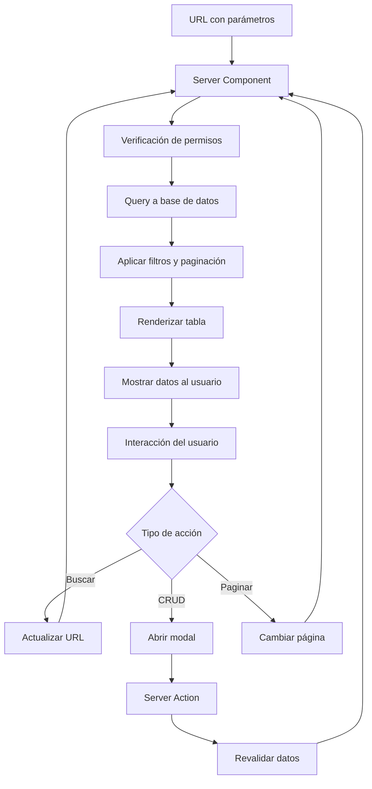

# 📋 Documentación de Páginas de Listas - CoreAppEduTech

## Introducción

Las páginas de listas constituyen el núcleo de la gestión administrativa del sistema CoreAppEduTech. Estas páginas permiten visualizar, buscar, filtrar y gestionar todas las entidades del sistema educativo de manera eficiente y organizada.

## 🏗️ Arquitectura de Páginas de Lista

### Estructura Común
Todas las páginas de lista siguen un patrón arquitectónico consistente:

```typescript
interface ListPageStructure {
  header: {
    title: string;
    searchBar: TableSearch;
    createButton?: FormModal;
  };
  table: {
    columns: TableColumn[];
    data: any[];
    actions: CRUDActions[];
  };
  pagination: {
    currentPage: number;
    totalPages: number;
    itemsPerPage: number;
  };
}
```

### Flujo de Datos


## 👨‍🏫 Lista de Profesores

### `/list/teachers` - Gestión de Profesores

**Roles Permitidos**: `admin`, `teacher` (lectura limitada)

**Propósito**: Gestión completa del personal docente.

**Características:**
- ✅ Búsqueda por nombre, email, teléfono
- ✅ Filtrado por materias asignadas
- ✅ Visualización de clases a cargo
- ✅ CRUD completo (admin) / Lectura (teacher)
- ✅ Exportación de datos
- ✅ Vista detallada de profesor

```typescript
// app/(dashboard)/list/teachers/page.tsx
import FormContainer from "@/components/FormContainer";
import Pagination from "@/components/Pagination";
import Table from "@/components/Table";
import TableSearch from "@/components/TableSearch";
import prisma from "@/lib/prisma";
import { ITEM_PER_PAGE } from "@/lib/settings";
import { auth } from "@clerk/nextjs/server";
import { Teacher, Subject, Class } from "@prisma/client";
import Image from "next/image";

type TeacherList = Teacher & { subjects: Subject[] } & { classes: Class[] };

const columns = [
  {
    header: "Información",
    accessor: "info",
  },
  {
    header: "ID de Profesor",
    accessor: "teacherId",
    className: "hidden md:table-cell",
  },
  {
    header: "Materias",
    accessor: "subjects",
    className: "hidden md:table-cell",
  },
  {
    header: "Clases",
    accessor: "classes",
    className: "hidden md:table-cell",
  },
  {
    header: "Teléfono",
    accessor: "phone",
    className: "hidden lg:table-cell",
  },
  {
    header: "Dirección",
    accessor: "address",
    className: "hidden lg:table-cell",
  },
  ...(role === "admin" ? [
    {
      header: "Acciones",
      accessor: "action",
    }
  ] : [])
];

const renderRow = (item: TeacherList) => (
  <tr
    key={item.id}
    className="border-b border-gray-200 even:bg-slate-50 text-sm hover:bg-lamaPurpleLight"
  >
    <td className="flex items-center gap-4 p-4">
      <Image
        src={item.img || "/noAvatar.png"}
        alt=""
        width={40}
        height={40}
        className="md:hidden xl:block w-10 h-10 rounded-full object-cover"
      />
      <div className="flex flex-col">
        <h3 className="font-semibold">{item.name} {item.surname}</h3>
        <p className="text-xs text-gray-500">{item?.email}</p>
      </div>
    </td>
    <td className="hidden md:table-cell">{item.username}</td>
    <td className="hidden md:table-cell">
      {item.subjects.map((subject) => subject.name).join(", ")}
    </td>
    <td className="hidden md:table-cell">
      {item.classes.map((classItem) => classItem.name).join(", ")}
    </td>
    <td className="hidden lg:table-cell">{item.phone}</td>
    <td className="hidden lg:table-cell">{item.address}</td>
    {role === "admin" && (
      <td>
        <div className="flex items-center gap-2">
          <Link href={`/list/teachers/${item.id}`}>
            <button className="w-7 h-7 flex items-center justify-center rounded-full bg-lamaSky">
              <Image src="/view.png" alt="" width={16} height={16} />
            </button>
          </Link>
          <FormContainer table="teacher" type="update" data={item} />
          <FormContainer table="teacher" type="delete" id={item.id} />
        </div>
      </td>
    )}
  </tr>
);

const TeacherListPage = async ({
  searchParams,
}: {
  searchParams: { [key: string]: string | undefined };
}) => {
  const { sessionClaims } = auth();
  const role = (sessionClaims?.metadata as { role?: string })?.role;
  
  const { page, search, ...queryParams } = searchParams;
  const p = page ? parseInt(page) : 1;

  // Construcción de query con filtros
  const query: Prisma.TeacherWhereInput = {};
  
  if (search) {
    query.OR = [
      { name: { contains: search, mode: "insensitive" } },
      { surname: { contains: search, mode: "insensitive" } },
      { email: { contains: search, mode: "insensitive" } },
      { phone: { contains: search, mode: "insensitive" } },
    ];
  }

  // Filtros adicionales basados en parámetros
  for (const [key, value] of Object.entries(queryParams)) {
    if (value !== undefined) {
      switch (key) {
        case "subjectId":
          query.subjects = { some: { id: parseInt(value) } };
          break;
        case "classId":
          query.classes = { some: { id: parseInt(value) } };
          break;
      }
    }
  }

  const [teachers, count] = await prisma.$transaction([
    prisma.teacher.findMany({
      where: query,
      include: {
        subjects: true,
        classes: true,
      },
      take: ITEM_PER_PAGE,
      skip: ITEM_PER_PAGE * (p - 1),
    }),
    prisma.teacher.count({ where: query }),
  ]);

  return (
    <div className="bg-white p-4 rounded-md flex-1 m-4 mt-0">
      {/* TOP */}
      <div className="flex items-center justify-between">
        <h1 className="hidden md:block text-lg font-semibold">
          Todos los Profesores
        </h1>
        <div className="flex flex-col md:flex-row items-center gap-4 w-full md:w-auto">
          <TableSearch />
          {role === "admin" && (
            <div className="flex items-center gap-4 self-end">
              <button className="w-8 h-8 flex items-center justify-center rounded-full bg-lamaYellow">
                <Image src="/filter.png" alt="" width={14} height={14} />
              </button>
              <button className="w-8 h-8 flex items-center justify-center rounded-full bg-lamaYellow">
                <Image src="/sort.png" alt="" width={14} height={14} />
              </button>
              <FormContainer table="teacher" type="create" />
            </div>
          )}
        </div>
      </div>
      
      {/* LIST */}
      <Table columns={columns} renderRow={renderRow} data={teachers} />
      
      {/* PAGINATION */}
      <Pagination page={p} count={count} />
    </div>
  );
};

export default TeacherListPage;
```

**Funcionalidades Específicas:**
- **Búsqueda Avanzada**: Por nombre, apellido, email, teléfono
- **Filtros**: Por materia asignada, clase supervisada
- **Vista Detallada**: Información completa del profesor
- **Gestión de Materias**: Asignación y desasignación
- **Historial Académico**: Clases previas y actuales

## 🎓 Lista de Estudiantes

### `/list/students` - Gestión de Estudiantes

**Roles Permitidos**: `admin`, `teacher` (estudiantes de sus clases)

**Propósito**: Administración del cuerpo estudiantil.

**Características:**
- ✅ Búsqueda por información personal
- ✅ Filtrado por clase, grado, estado
- ✅ Gestión de asistencias y calificaciones
- ✅ Información familiar y médica
- ✅ Historial académico completo

```typescript
// Estructura de datos para estudiantes
type StudentList = Student & {
  class: Class & { grade: Grade };
  parent: Parent;
  attendances: Attendance[];
  results: Result[];
};

const columns = [
  { header: "Información", accessor: "info" },
  { header: "ID de Estudiante", accessor: "studentId", className: "hidden md:table-cell" },
  { header: "Grado & Clase", accessor: "grade", className: "hidden md:table-cell" },
  { header: "Padre/Madre", accessor: "parent", className: "hidden lg:table-cell" },
  { header: "Teléfono", accessor: "phone", className: "hidden lg:table-cell" },
  { header: "Dirección", accessor: "address", className: "hidden lg:table-cell" },
  ...(role === "admin" ? [{ header: "Acciones", accessor: "action" }] : [])
];

// Funciones de filtrado específicas para estudiantes
const buildStudentQuery = (searchParams: any, role: string, teacherId?: string) => {
  const query: Prisma.StudentWhereInput = {};
  
  // Filtro por rol - los profesores solo ven sus estudiantes
  if (role === "teacher" && teacherId) {
    query.class = {
      lessons: {
        some: {
          teacherId: teacherId
        }
      }
    };
  }
  
  // Filtros de búsqueda
  if (searchParams.search) {
    query.OR = [
      { name: { contains: searchParams.search, mode: "insensitive" } },
      { surname: { contains: searchParams.search, mode: "insensitive" } },
      { class: { name: { contains: searchParams.search, mode: "insensitive" } } }
    ];
  }
  
  return query;
};
```

**Información Mostrada:**
- Datos personales y académicos
- Clase y grado actual
- Información de contacto familiar
- Estadísticas de asistencia
- Promedio de calificaciones

## 👨‍👩‍👧‍👦 Lista de Padres

### `/list/parents` - Gestión de Padres

**Roles Permitidos**: `admin`, `teacher` (padres de sus estudiantes)

**Propósito**: Administración de información familiar.

**Características:**
- ✅ Gestión de información de contacto
- ✅ Vinculación con estudiantes
- ✅ Historial de comunicaciones
- ✅ Datos de emergencia
- ✅ Preferencias de notificación

```typescript
type ParentList = Parent & {
  students: Student[];
  _count: {
    students: number;
  };
};

// Columnas específicas para padres
const parentColumns = [
  { header: "Información", accessor: "info" },
  { header: "Estudiantes", accessor: "students", className: "hidden md:table-cell" },
  { header: "Teléfono", accessor: "phone" },
  { header: "Email", accessor: "email", className: "hidden lg:table-cell" },
  { header: "Dirección", accessor: "address", className: "hidden lg:table-cell" },
  { header: "Acciones", accessor: "action" }
];
```

## 🏫 Lista de Clases

### `/list/classes` - Gestión de Clases

**Roles Permitidos**: `admin`

**Propósito**: Administración de aulas y grupos estudiantiles.

**Características:**
- ✅ Gestión de capacidad y distribución
- ✅ Asignación de profesores supervisores
- ✅ Configuración de horarios
- ✅ Estadísticas de ocupación
- ✅ Gestión de recursos del aula

```typescript
type ClassList = Class & {
  supervisor: Teacher;
  grade: Grade;
  students: Student[];
  lessons: Lesson[];
  _count: {
    students: number;
    lessons: number;
  };
};

// Información específica de clases
const classInfo = {
  capacity: "Capacidad máxima del aula",
  currentStudents: "Estudiantes actuales",
  supervisor: "Profesor supervisor",
  grade: "Grado académico",
  schedule: "Horario de clases",
  resources: "Recursos disponibles"
};
```

## 📚 Lista de Materias

### `/list/subjects` - Gestión de Materias

**Roles Permitidos**: `admin`

**Propósito**: Administración del currículo académico.

**Características:**
- ✅ Configuración de plan de estudios
- ✅ Asignación de profesores especializados
- ✅ Gestión de contenido curricular
- ✅ Estadísticas de rendimiento por materia
- ✅ Recursos didácticos

```typescript
type SubjectList = Subject & {
  teachers: Teacher[];
  lessons: Lesson[];
  _count: {
    teachers: number;
    lessons: number;
  };
};
```

## 📖 Lista de Lecciones

### `/list/lessons` - Gestión de Lecciones

**Roles Permitidos**: `admin`, `teacher` (sus lecciones)

**Propósito**: Programación y gestión de clases.

**Características:**
- ✅ Calendario de lecciones
- ✅ Gestión de horarios
- ✅ Asignación de recursos
- ✅ Control de asistencias
- ✅ Material didáctico

```typescript
type LessonList = Lesson & {
  subject: Subject;
  class: Class;
  teacher: Teacher;
  attendances: Attendance[];
  exams: Exam[];
  assignments: Assignment[];
};

// Horarios y programación
const scheduleInfo = {
  dayOfWeek: "Día de la semana",
  startTime: "Hora de inicio",
  endTime: "Hora de finalización",
  duration: "Duración calculada",
  recurrence: "Frecuencia semanal"
};
```

## 📝 Lista de Exámenes

### `/list/exams` - Gestión de Exámenes

**Roles Permitidos**: `admin`, `teacher` (sus exámenes)

**Propósito**: Administración de evaluaciones.

**Características:**
- ✅ Programación de evaluaciones
- ✅ Gestión de resultados
- ✅ Análisis estadístico
- ✅ Configuración de criterios
- ✅ Reportes de rendimiento

```typescript
type ExamList = Exam & {
  lesson: Lesson & {
    subject: Subject;
    class: Class;
    teacher: Teacher;
  };
  results: Result[];
  _count: {
    results: number;
  };
};

// Métricas de exámenes
const examMetrics = {
  averageScore: "Promedio general",
  participationRate: "Tasa de participación",
  passRate: "Tasa de aprobación",
  difficulty: "Nivel de dificultad",
  duration: "Tiempo promedio"
};
```

## 📋 Lista de Tareas

### `/list/assignments` - Gestión de Tareas

**Roles Permitidos**: `admin`, `teacher` (sus tareas)

**Propósito**: Administración de trabajos y proyectos.

**Características:**
- ✅ Programación de entregas
- ✅ Seguimiento de progreso
- ✅ Gestión de calificaciones
- ✅ Retroalimentación detallada
- ✅ Estadísticas de cumplimiento

```typescript
type AssignmentList = Assignment & {
  lesson: Lesson & {
    subject: Subject;
    class: Class;
    teacher: Teacher;
  };
  results: Result[];
  _count: {
    results: number;
  };
};
```

## 📊 Lista de Resultados

### `/list/results` - Gestión de Resultados

**Roles Permitidos**: `admin`, `teacher` (resultados de sus clases)

**Propósito**: Administración de calificaciones y evaluaciones.

**Características:**
- ✅ Registro de calificaciones
- ✅ Análisis de rendimiento
- ✅ Reportes académicos
- ✅ Seguimiento de progreso
- ✅ Identificación de estudiantes en riesgo

```typescript
type ResultList = Result & {
  student: Student;
  exam?: Exam & {
    lesson: Lesson & {
      subject: Subject;
      class: Class;
    };
  };
  assignment?: Assignment & {
    lesson: Lesson & {
      subject: Subject;
      class: Class;
    };
  };
};
```

## 📅 Lista de Eventos

### `/list/events` - Gestión de Eventos

**Roles Permitidos**: `admin`

**Propósito**: Administración de actividades escolares.

**Características:**
- ✅ Calendario de eventos
- ✅ Gestión de participantes
- ✅ Recursos y logística
- ✅ Comunicación y notificaciones
- ✅ Seguimiento post-evento

```typescript
type EventList = Event & {
  class?: Class;
  _count: {
    attendees: number;
  };
};
```

## 📢 Lista de Anuncios

### `/list/announcements` - Gestión de Anuncios

**Roles Permitidos**: `admin`, `teacher` (para sus clases)

**Propósito**: Sistema de comunicación interna.

**Características:**
- ✅ Creación y programación
- ✅ Segmentación por audiencia
- ✅ Seguimiento de visualizaciones
- ✅ Priorización de mensajes
- ✅ Historial de comunicaciones

```typescript
type AnnouncementList = Announcement & {
  class?: Class;
};
```

## 🔧 Características Técnicas Comunes

### Paginación y Rendimiento
```typescript
const ITEM_PER_PAGE = 10;

// Optimización de queries
const optimizedQuery = {
  take: ITEM_PER_PAGE,
  skip: ITEM_PER_PAGE * (page - 1),
  include: {
    // Solo incluir relaciones necesarias
  },
  orderBy: {
    createdAt: 'desc'
  }
};
```

### Sistema de Búsqueda
```typescript
const searchConfig = {
  fields: ['name', 'surname', 'email', 'phone'],
  mode: 'insensitive' as const,
  operator: 'contains' as const
};
```

### Filtros Dinámicos
```typescript
const filterBuilder = (params: Record<string, string>) => {
  const filters: any = {};
  
  Object.entries(params).forEach(([key, value]) => {
    if (value && key !== 'page' && key !== 'search') {
      filters[key] = { equals: value };
    }
  });
  
  return filters;
};
```

### Gestión de Permisos
```typescript
const getPermissions = (role: string, resourceType: string) => {
  const permissions = {
    admin: ['create', 'read', 'update', 'delete'],
    teacher: ['read', 'update'], // Solo sus recursos
    student: ['read'], // Solo su información
    parent: ['read'] // Solo información de sus hijos
  };
  
  return permissions[role] || [];
};
```

## 🎨 Componentes UI Reutilizables

### TableSearch Component
```typescript
const TableSearch = () => {
  const router = useRouter();
  
  const handleSubmit = (e: React.FormEvent) => {
    e.preventDefault();
    const formData = new FormData(e.target as HTMLFormElement);
    const search = formData.get('search') as string;
    
    const params = new URLSearchParams(window.location.search);
    if (search) {
      params.set('search', search);
    } else {
      params.delete('search');
    }
    
    router.push(`${window.location.pathname}?${params.toString()}`);
  };
  
  return (
    <form onSubmit={handleSubmit} className="w-full md:w-auto flex items-center gap-2">
      <input
        type="text"
        name="search"
        placeholder="Buscar..."
        className="px-3 py-2 border rounded-lg"
      />
      <button type="submit" className="px-4 py-2 bg-blue-500 text-white rounded-lg">
        Buscar
      </button>
    </form>
  );
};
```

### Pagination Component
```typescript
const Pagination = ({ page, count }: { page: number; count: number }) => {
  const router = useRouter();
  const totalPages = Math.ceil(count / ITEM_PER_PAGE);
  
  const changePage = (newPage: number) => {
    const params = new URLSearchParams(window.location.search);
    params.set('page', newPage.toString());
    router.push(`${window.location.pathname}?${params.toString()}`);
  };
  
  return (
    <div className="flex justify-between items-center mt-4">
      <button
        onClick={() => changePage(page - 1)}
        disabled={page <= 1}
        className="px-4 py-2 bg-gray-200 rounded disabled:opacity-50"
      >
        Anterior
      </button>
      
      <span>Página {page} de {totalPages}</span>
      
      <button
        onClick={() => changePage(page + 1)}
        disabled={page >= totalPages}
        className="px-4 py-2 bg-gray-200 rounded disabled:opacity-50"
      >
        Siguiente
      </button>
    </div>
  );
};
```

## 📱 Responsive Design

### Breakpoints y Adaptabilidad
```css
/* Mobile First Approach */
.table-container {
  @apply overflow-x-auto;
}

/* Tablet */
@media (min-width: 768px) {
  .hidden-mobile {
    @apply table-cell;
  }
}

/* Desktop */
@media (min-width: 1024px) {
  .hidden-tablet {
    @apply table-cell;
  }
}
```

### Componentes Adaptativos
- **Tablas**: Scroll horizontal en móvil
- **Formularios**: Stack vertical en pantallas pequeñas
- **Navegación**: Menú hamburguesa en móvil
- **Búsqueda**: Expandible en dispositivos pequeños

Esta estructura de páginas de lista proporciona una experiencia consistente y eficiente para la gestión de todos los aspectos del sistema educativo, manteniendo la usabilidad y performance como prioridades principales.